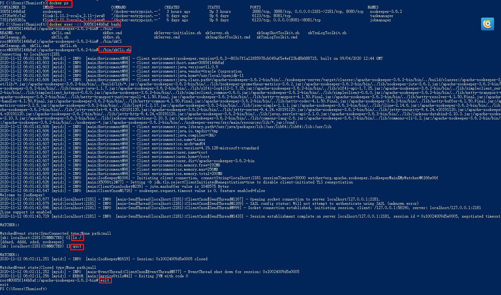

# 1.参考
[https://hub.docker.com/_/zookeeper](https://hub.docker.com/_/zookeeper)

[https://github.com/31z4/zookeeper-docker](https://github.com/31z4/zookeeper-docker)

# 2.zookeeper镜像
```
#拉取镜像
docker pull zookeeper
#镜像详情
docker inspect zookeeper
```
# 3.单机

```
# 启动zookeeper容器，-d后台运行；-p端口映射；--name容器名称;--restart是否重启;{zookeeper}镜像名称或者ID。
# ip:8080/commands,访问管理界面
docker run -d -p 2181:2181 -p 8080:8080 --name zookeeper-3.6.2 --restart always zookeeper
# 查看运行容器
docker ps
# 访问容器
docker exec -it {容器ID} bash
```


完成后外部访问进行验证

# 4.集群
## 4.1 使用docker-compose
```
docker-compose -f cluster/stack.yml up -d
```
## 4.2 使用docker run
```
# 创建网络,避免IP
docker network create --driver bridge --subnet=172.18.0.0/16 --gateway=172.18.0.1 zoonet
```
```
docker run -d -p 2182:2181 --name zookeeper-node1 --restart always --privileged --network zoonet --ip 172.18.0.2 -e ZOO_MY_ID=1 -e "ZOO_SERVERS=server.1=172.18.0.2:2888:3888;2181 server.2=172.18.0.3:2888:3888;2181 server.3=172.18.0.4:2888:3888;2181" zookeeper
docker run -d -p 2183:2181 --name zookeeper-node2 --restart always --privileged --network zoonet --ip 172.18.0.3 -e ZOO_MY_ID=2 -e "ZOO_SERVERS=server.1=172.18.0.2:2888:3888;2181 server.2=172.18.0.3:2888:3888;2181 server.3=172.18.0.4:2888:3888;2181" zookeeper
docker run -d -p 2184:2181 --name zookeeper-node3 --restart always --privileged --network zoonet --ip 172.18.0.4 -e ZOO_MY_ID=3 -e "ZOO_SERVERS=server.1=172.18.0.2:2888:3888;2181 server.2=172.18.0.3:2888:3888;2181 server.3=172.18.0.4:2888:3888;2181" zookeeper
```

```
docker pull flink:1.11.2-scala_2.11-java8

FLINK_PROPERTIES="jobmanager.rpc.address: jobmanager"
docker network create flink-network
docker run -d --rm --name=jobmanager --network flink-network -p 8081:8081 --env FLINK_PROPERTIES="jobmanager.rpc.address: jobmanager" flink:1.11.2-scala_2.11-java8 jobmanager

docker run -d --rm --name=taskmanager2 --network flink-network --env FLINK_PROPERTIES="jobmanager.rpc.address: jobmanager" flink:1.11.2-scala_2.11-java8 taskmanager

```