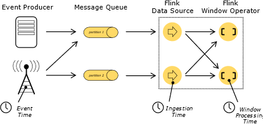

# 1.时间特征

```
DataStreamSource<String> dataSource = env.socketTextStream("172.16.32.35", 1234);
//设置时间特征，
env.setStreamTimeCharacteristic(TimeCharacteristic.EventTime);
```
* ProcessingTime 处理事件时间
* IngestionTime 进入flink系统时间（在source加载时间时候的时间）
* EventTime 事件时间
